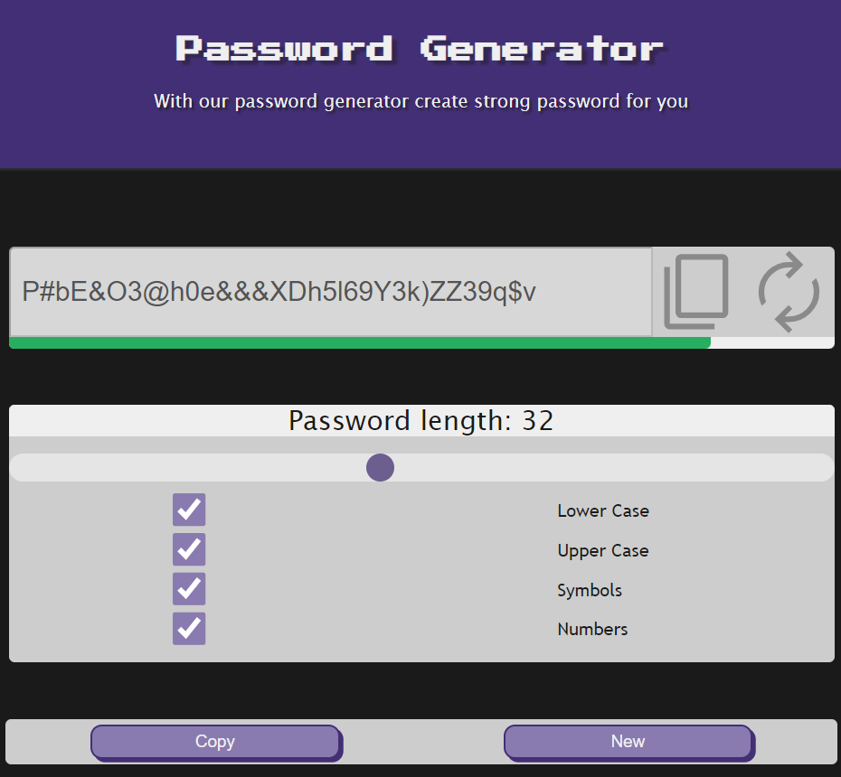

# 🔐 [Password-Generator](https://password-generator-one-tau.vercel.app)

A password generator created using React

# Screenshot

  

## 👨‍💻 Technologies

  
  
  
  

## Links

- Website URL: [Click here](https://password-generator-one-tau.vercel.app)

#

## Svgs

  
  
  

